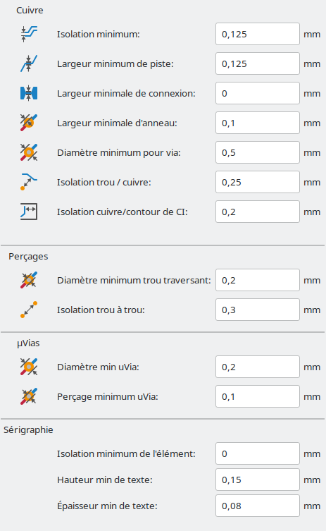

# Libraries KiCAD ENAC Robotique

## Installation

Clonez ce repo : `git clone https://github.com/ENACRobotique/kicad_libs_ENAC.git`

Ouvrez KiCAD et ajouter les librairies de symboles et d'empreintes :

- Préférences -> Configurer les librairies de Symboles...
    - Ajouter une librairie existante (2ème bouton en bas à gauche)
    - Sélectionnez les fichiers .kicad_sym dans le dossier symbols
- Préférences -> Configurer les librairies d'Empreintes...
    - Ajouter une librairie existante (2ème bouton en bas à gauche)
    - Sélectionnez le dossier ENAC_robotique.pretty

Ajoutez le chemin vers les modèles 3D:
- Préférences -> Configurer les chemins...
- Ajouter une variable "ENAC_3D_MODELS" avec comme valeur le chemin vers dossier "packages3d".

Vous êtes prêts !

## Recommandations de conception

### Empreintes

- Résistance et les condensateurs : utiliser tant que possible l'empreinte **0603** (1608 Metric)
- LEDs : **0603**

### Contraintes

**pistes**:

- 0.125 mm
- 0.250 mm
- 0.3 mm
- 0.5 mm
- 0.8 mm
- 1 mm

**Vias**:

- 0.7/0.4 mm
- 0.5/0.3 mm
